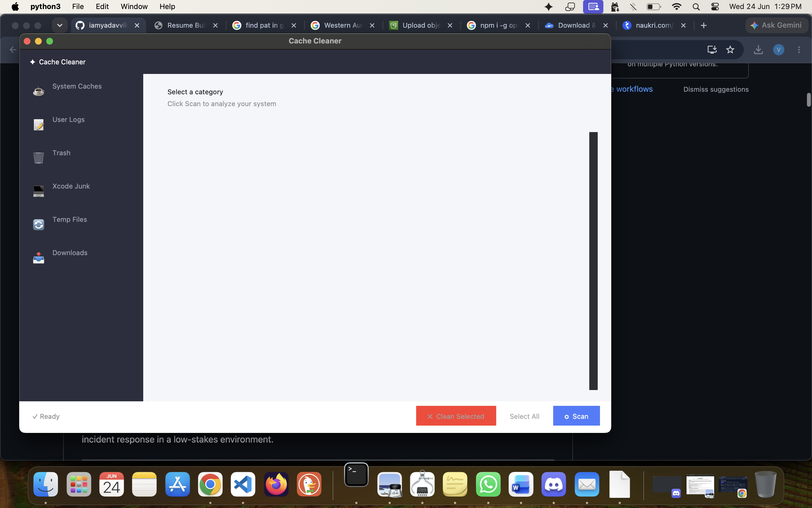

# macOS Cache Cleaner

A CleanMyMac X-style GUI tool to find and delete user caches, logs, Xcode junk, and temporary files on macOS.



## Usage

```sh
python3 cleanmymac.py
```

Click **Scan** to analyze, then select categories and items to clean.

## Categories

- System Caches
- User Logs  
- Trash
- Xcode Junk
- Temporary Files
- Downloads
